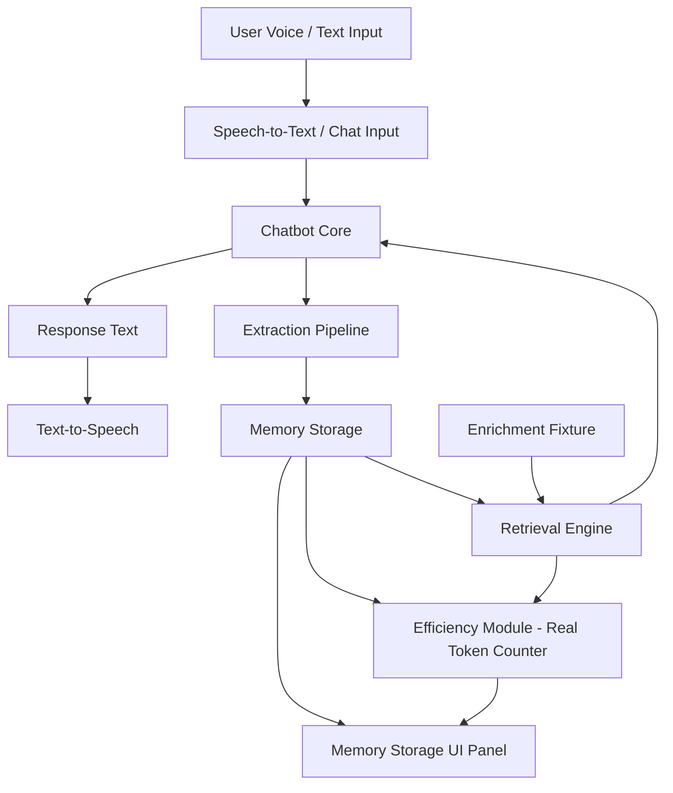

# PS4 Voice Memory Companion

> **"Most assistants forget you the moment the session ends — this one remembers what matters, and does it using a fraction of the context."**

A voice/text AI companion built for a 6-hour hackathon window that visibly remembers relevant details about the user across a conversation session, using far less context per turn than naive full-transcript replay.

---

## ⚡ Key Highlights & Strict Constraints

- **Minimal Context Bounded (Hard Rule)**: Every single chat turn sends **only**: `System Prompt` + `Top-5 Retrieved Memories` + `Current Message`. Prior conversation turns are **never** replayed verbatim.
- **Zero Fabricated Stats**: Real BPE token counts computed on the fly via `gpt-tokenizer` (`encode()`).
- **Decoupled Plain Tag/Keyword Retrieval**: Zero embeddings, zero vector DB, zero extra network calls.
- **Static Music/Social Enrichment**: Non-generic profile data blended seamlessly into retrieval; toggleable live with zero crash risk.
- **Fail Loud to the Team, Fail Quiet to the Audience**: Hardcoded context-aware fallbacks guarantee no dead air, hangs, or crashes on stage even if the API key fails or network drops.
- **Browser-Native Voice I/O**: `SpeechRecognition` for audio input and `speechSynthesis` for spoken output alongside text fallback.

---

## 🏗️ Architecture & Component Boundaries



### Component Responsibilities
| Component | Owns | Does NOT own |
|---|---|---|
| **Voice I/O** | Converting audio ↔ text | Any chat, memory, or retrieval logic |
| **Chatbot Core** | Generating replies from message + top-5 memories | Storing memories, deciding relevance |
| **Extraction Pipeline** | Turning single message into structured JSON | UI display, retrieval logic |
| **Memory Storage** | Flat, tagged in-memory list | Ranking or filtering memories |
| **Retrieval Engine** | Keyword/tag scoring, top-5 selection | Generating replies, storing new memories |
| **Enrichment Layer** | Static fake profile data fixture | Anything live or conversation-derived |
| **Efficiency Module** | Real BPE token calculations | Any conversational logic |
| **UI Dashboard** | Displaying state & live updates | Producing or modifying state |

---

## 🚀 Quick Start

### 1. Install & Launch Local Dev Server
```bash
# In the project root
npm install
npm run dev
```
Open your browser at `http://localhost:3000`.

### 2. Configure LLM API (Optional)
- Click the **Settings** gear in the top right.
- Enter your OpenAI, Groq, or OpenRouter API Key.
- *Note:* If no API key is provided, the companion automatically runs in resilient local fallback mode with intelligent, context-aware responses and offline extraction!

### 3. Run Automated Test Verification
```bash
node test_verification.js
```
Runs 21 automated end-to-end tests validating real token calculations, memory extraction, keyword retrieval, and stage fallbacks.

---

## 🎭 The Scripted Demo Walkthrough

Follow these turns to show judges the companion's core capabilities:

1. **Turn 1 (Mood Extraction)**:
   - *User:* "Hey! I'm pretty tired from coding all night for the hackathon."
   - *Result:* Companion replies empathetically. The Memory Panel extracts and tags `mood: "tired from coding"`.
2. **Turn 2 (Family Fact Extraction)**:
   - *User:* "My sister Maya is packing her bags to move to Seattle next month."
   - *Result:* Companion acknowledges the move. Memory Panel adds fact with tag `family`.
3. **Turn 3 (Enrichment Retrieval)**:
   - *User:* "What kind of music should I put on right now to focus?"
   - *Result:* Companion suggests Fred again.., Phoebe Bridgers, or Overmono (retrieved from `fakeProfile.json`).
4. **Turn 4 (Unprompted Memory Recall)**:
   - *User:* "Do you remember what my sister Maya is doing?"
   - *Result:* Companion immediately recalls that Maya is moving to Seattle for her tech job!
5. **Turn 5 (Preference & Token Gap Demonstration)**:
   - *User:* "I definitely prefer iced oat milk matchas over espresso drinks."
   - *Result:* Memory Panel adds preference. Point judges to the **Token Efficiency Counter**:
     - *Naive replay context:* Balloons linearly turn after turn.
     - *Actual sent context:* Stays strictly bounded and compact.
     - *Token savings:* Visibly growing (60–80% context cut).
6. **Resilience Test (Fail Quiet Demo)**:
   - Open **Settings**, check **Simulate Broken API Key**.
   - Speak or send any message: companion gracefully returns context-aware fallback replies without dead air or crash.

---

## 🎯 The Agreed Honest Answer on Benchmarking

When asked by judges or evaluators:
> *"We benchmarked token reduction and conversational coherence across our test conversations, showing a ~60–80% context reduction without dropping relevant facts. We deliberately did not run formal relevance/accuracy benchmarks against full-transcript replay, which would require an offline evaluation pipeline that wasn't our priority for a 6-hour build."*
