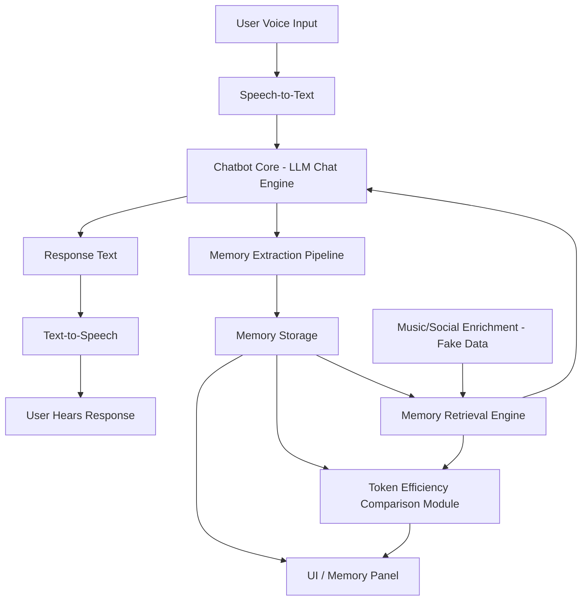
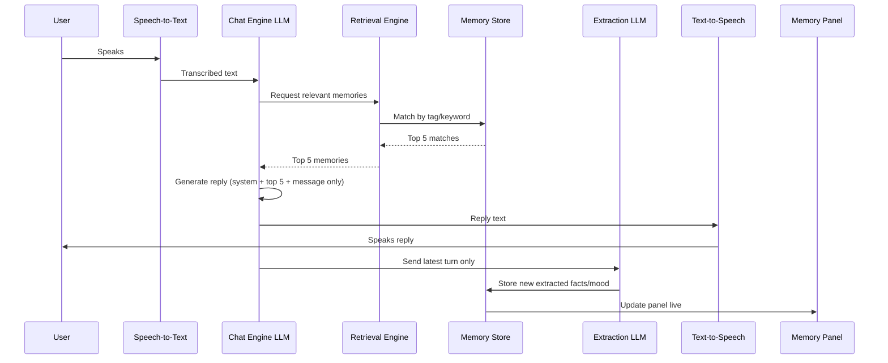

# Architecture — PS4 Voice Memory Companion

## System Overview

The system is split into two independent shells (voice, enrichment) wrapped around one core loop (chat + memory), plus two passive display layers (efficiency counter, UI panel) that read from the core but never write to it. This separation matters: any single piece can fail or be cut without collapsing the others.

## High-Level Architecture

## Turn-by-Turn Data Flow

## Component Responsibilities

| Component | Owns | Does NOT own |
|---|---|---|
| Voice I/O | Converting audio ↔ text | Any chat, memory, or retrieval logic |
| Chatbot Core | Generating replies from message + top-5 memories | Storing memories, deciding which memories are relevant |
| Extraction Pipeline | Turning one message into structured JSON | Deciding what's shown in the UI, retrieval logic |
| Memory Storage | Holding the flat, tagged memory list | Ranking or filtering memories |
| Retrieval Engine | Ranking and selecting top-5 memories per turn | Generating replies, storing new memories |
| Enrichment Layer | Supplying static fake profile data | Anything live, anything conversation-derived |
| Efficiency Module | Computing and reporting token counts | Any conversational logic |
| UI / Memory Panel | Displaying state | Producing or modifying state |

## Design Principles

- **Minimal context, always.** No call ever receives more than: current message, top-5 memories, and a short system prompt. This is the architectural rule the entire efficiency claim depends on — if this rule breaks anywhere, the demo's core claim breaks with it.
- **Decoupled layers.** Voice, memory, enrichment, and display are all separable. Any one of them should be removable without the others breaking, so a struggling feature can be cut live without a rewrite.
- **Predictable over sophisticated.** Keyword/tag matching is chosen over embeddings deliberately — a slightly less "impressive" mechanism that behaves consistently in a live demo beats a more advanced one that behaves unpredictably under pressure.
- **Fail loud to the team, fail quiet to the audience.** Every external call has a hardcoded fallback so a failure never produces dead air or a crash on stage — but failures should still be logged/visible to the team during testing.
- **Real numbers only.** The efficiency comparison reports actual token counts computed from real data — never a fabricated or illustrative number.

## Cross-Reference / Dependency Map

| Component | Depends on | Feeds into |
|---|---|---|
| Voice I/O | — | Chatbot Core |
| Chatbot Core | Retrieval Engine, Voice I/O | Voice I/O, Extraction Pipeline |
| Extraction Pipeline | Chatbot Core (raw turn) | Memory Storage |
| Memory Storage | Extraction Pipeline | Retrieval Engine, UI Panel, Efficiency Module |
| Retrieval Engine | Memory Storage, Enrichment Layer | Chatbot Core, Efficiency Module |
| Enrichment Layer | — (static data) | Retrieval Engine |
| Efficiency Module | Memory Storage, Retrieval Engine | UI Panel |
| UI Panel | Memory Storage, Efficiency Module | — (end display) |

## Tech Stack

| Layer | Tool | Why |
|---|---|---|
| Frontend | React + Tailwind | Fast to scaffold, team-familiar |
| Voice I/O | Browser Web Speech API | Free, no external service, no auth |
| Chat + Extraction | One LLM API, two minimal-context calls | Single external dependency to manage |
| Storage | In-memory array / JSON file | No setup cost, sufficient for a session-length demo |
| Retrieval | Plain JS keyword/tag matching | Predictable, no extra API call or cost |
| Enrichment | Static hardcoded JSON | Zero integration risk, zero new-gateway tax |
| Hosting | Local dev server | No deployment needed for a live demo |

**Total external dependencies: 1** — the LLM API, called twice per turn.
